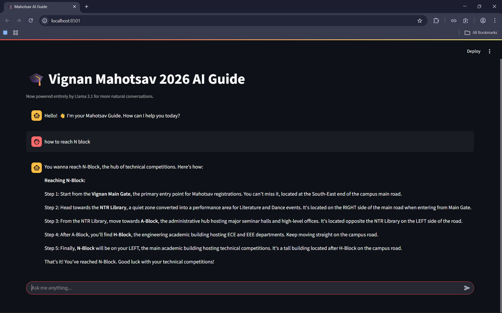

# 🎓 Vignan Mahotsav 2026 NavAI Guide

> Your smart campus companion for Mahotsav 2026 @ Vignan University  
> Powered by Llama 3.1 + Streamlit + Graph Navigation

---

## 📸 Preview



---

## ✨ Overview

The Mahotsav AI Guide is an intelligent chatbot that helps students:

- Navigate campus easily 🗺️  
- Discover events 🎉  
- Get instant directions 📍  

It combines AI + Graph Algorithms + UI to create a real-time campus assistant.

---

## 🚀 Features

- 📍 Smart navigation with step-by-step directions  
- 🧠 Natural conversations using Llama 3.1 (Groq API)  
- 🗺️ Graph-based shortest path (BFS)  
- 🎯 Context-aware responses from campus data  
- 💬 Chat interface using Streamlit  

---

## 🏗️ Tech Stack

- Frontend: Streamlit  
- Backend: Python  
- AI Model: Llama 3.1 (via Groq)  
- Algorithm: Breadth First Search (BFS)  
- Data: JSON-based campus map  

---

## 📂 Project Structure

```
mahotsav-ai-guide/
│── app.py
│── campus_data.json
│── Screenshot.png
│── README.md
```

---

## ⚙️ Installation

### 1. Clone the repository
```bash
git clone https://github.com/rtwk3/Vignan-NaviBot/
cd mahotsav-ai-guide
```

### 2. Install dependencies
```bash
pip install streamlit langchain langchain-groq
```

### 3. Add your Groq API Key
```bash
export GROQ_API_KEY="your_api_key_here"
```

(Windows)
```bash
set GROQ_API_KEY=your_api_key_here
```

---

## ▶️ Run the App

```bash
streamlit run app.py
```

Open in browser:
```
http://localhost:8501
```

---

## 🧠 How It Works

### Step 1: User Query
```
How to reach N Block?
```

### Step 2: Place Detection
- Extracts start and destination  
- Matches with campus JSON  

### Step 3: Pathfinding
- Uses BFS algorithm  
- Finds shortest path  

### Step 4: AI Response
```
Step 1: Start from Main Gate  
Step 2: Go to Library  
Step 3: Move towards A-Block  
Step 4: Continue to H-Block  
Step 5: Reach N-Block  
```

---

## 📊 Campus Data Example

```json
{
  "main_gate": {
    "name": "Vignan Main Gate",
    "connected_to": ["library", "a_block"]
  }
}
```

---

## 🎯 Future Improvements

- Live GPS navigation  
- Interactive campus map  
- Mobile app version  
- Voice assistant integration  
- Event registration system  

---

## 🤝 Contributing

Pull requests are welcome!

1. Fork the repo  
2. Create your feature branch  
3. Commit changes  
4. Open a Pull Request  
  

---

## ⭐ Support

If you like this project:

- Star the repo  
- Fork it  
- Share with friends  

---

## 💡 Inspiration

Built to solve real problems faced during college fests —  
no more getting lost during Mahotsav 😄
